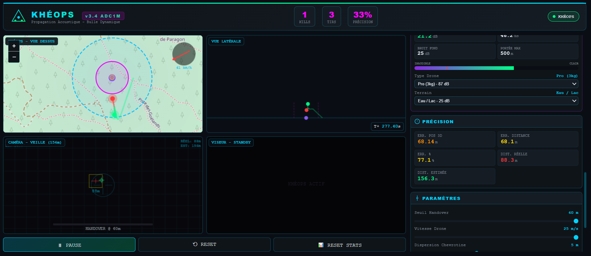

# 🎯 One-Page-One-Mission (Khéops)

**Acoustic drone detection and fire control simulator** with real-time 3D localization.

## 🚀 Features

- **TDOA Multilateration** — Chan algorithm for 3D position estimation
- **Kalman Filter** — 6-state fusion (position + velocity)
- **RANSAC** — Outlier rejection for robust tracking
- **ISO 9613-1** — Accurate speed of sound calculation (temperature, humidity, pressure, CO₂)
- **Doppler Integration** — Radial velocity estimation with dead-zone handling
- **Wind Simulation** — Realistic atmospheric perturbation model
- **Fire Control** — Automatic handover from acoustic to optical tracking
- **Real-time Visualization** — Leaflet map, side view, camera view, reticle

## 🛠️ Tech Stack

- Pure HTML/CSS/JavaScript
- No external dependencies (except Leaflet for map tiles)
- Runs entirely in browser
- Single file, ~3000 lines

## 📖 Usage

1. Open \`index.html\` in your browser
2. Click **START** to begin simulation
3. Adjust parameters in the sidebar (wind, drone speed, temperature...)
4. Watch the acoustic system track the drone and hand over to optical fire control

## 🎓 Educational Purpose

This simulator demonstrates:
- Passive acoustic localization techniques
- Sensor fusion with Kalman filtering
- Counter-UAS (Unmanned Aerial System) concepts
- Real-time signal processing in JavaScript

## 📄 License

CC BY-NC 4.0 — Non-commercial use only.

## 👤 Author

**Eric PERRET** — [GitHub](https://github.com/ericperret)

